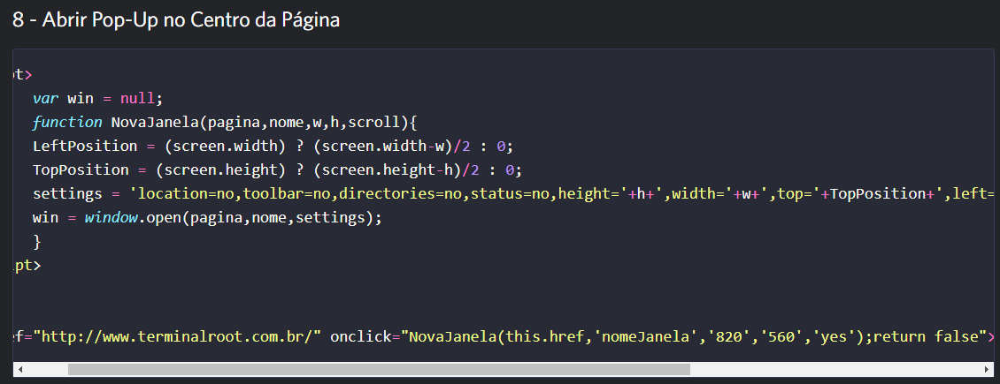
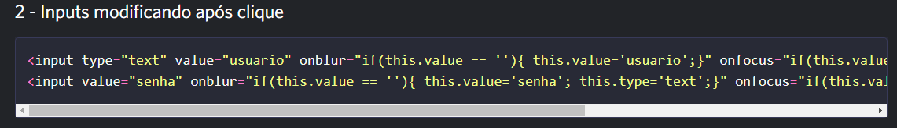

### projeto anlisando códigos 

 para esse projeto tivemos que escolher 2 códigos colocar no VScode e enterder seus significados, qual a função usada pra criar cada coisa, sua ultilidade e o que representa.

# Primeira parte do código 

 

 ### código escolhido número 8

* Left Position: refere-se á posição horizontal de um elemento
* screen.widthi: para dar a largura de tela pixel 
* Top position:  top é usada para definir a posição vertical de um elemento, position para posicionar   elementos de forma precisa em uma página da web 
* screen.height usado para dar altura  na tela 

# Segundo código número 2 

esse código é diferente que o outro, usado para você abrir em uma conta, exemplificação de como fica:

 

